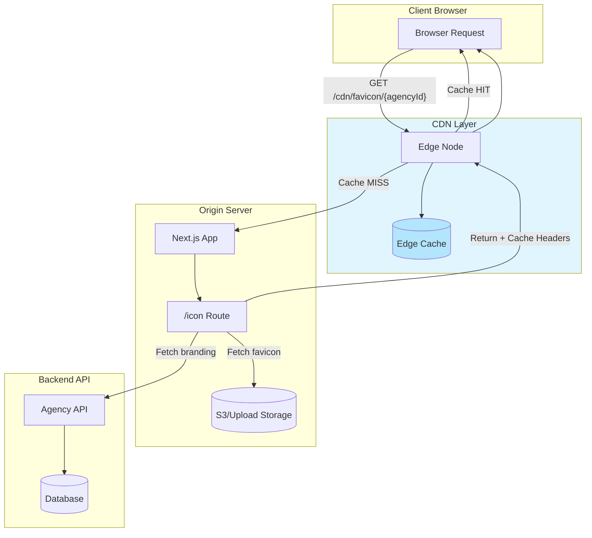

# Brand Theming CDN Architecture

[← Back to Index](./index.md)

## Diagrammatic Overview



## Overview

This document outlines the architecture for integrating CDN-based delivery of branding assets (favicons, logos) to improve performance and reduce origin server load.

## Design Principles

### 1. Cache Key Strategy

The CDN cache key must incorporate the agency identifier to ensure correct favicon delivery:

```
/cdn/favicon/{agencyId}.{format}
/cdn/logo/{agencyId}.{format}
/cdn/apple-icon/{agencyId}.{format}
```

**Rationale**: Using agency ID in the URL path allows CDN to cache different favicons for different agencies without cookie-based cache variance.

### 2. Cache Invalidation

When an agency updates their branding:
1. Backend saves new favicon to S3
2. Backend triggers CDN cache purge for that agency's assets
3. Next request fetches fresh asset

**Alternative**: Use content-addressable URLs:
```
/cdn/favicon/{agencyId}/{contentHash}.{format}
```

### 3. Fallback Strategy

```
Priority 1: CDN cached asset
Priority 2: Origin server fetch from S3
Priority 3: Default AssignX favicon
```

## Component Architecture

### Option A: CDN Redirect (Recommended)

The favicon routes redirect to CDN URLs instead of proxying content:

```javascript
// app/icon.js
export default async function Icon() {
  const branding = await getServerBranding()

  if (branding?.agencyId && branding?.faviconUrl) {
    // Redirect to CDN URL
    const cdnUrl = `${CDN_BASE_URL}/favicon/${branding.agencyId}.png`
    return Response.redirect(cdnUrl, 302)
  }

  // Serve default favicon
  return new Response(defaultFavicon, { ... })
}
```

**Pros**:
- Minimal origin server load
- Leverages CDN caching fully
- Simple implementation

**Cons**:
- Extra redirect on first load
- Requires CDN infrastructure

### Option B: CDN Pull-Through

CDN pulls from origin, origin fetches from S3:

```
Browser → CDN → /icon route → S3
         ↓
      (cached)
```

**Pros**:
- No redirect overhead
- Works with existing routes

**Cons**:
- Origin still involved on cache miss
- More complex cache headers

### Option C: Direct S3 + CDN

Upload favicons directly to CDN-fronted S3 bucket:

```
Browser → CDN → S3
         ↓
      (cached)
```

**Pros**:
- Fastest delivery
- No origin involvement

**Cons**:
- Requires middleware/backend changes
- Different architecture for assets

## Recommended Architecture

**Option A (CDN Redirect)** is recommended for these reasons:

1. **Minimal changes**: Only modify `icon.js` and `apple-icon.js`
2. **Clear separation**: CDN handles caching, origin handles logic
3. **Graceful fallback**: Can still serve default favicon from origin

## CDN Requirements

| Requirement | Description |
|-------------|-------------|
| **Edge locations** | Global distribution for fast delivery |
| **Cache TTL** | Minimum 24 hours, ideally 7 days |
| **Purge API** | Programmatic cache invalidation |
| **Custom headers** | Support for `Cache-Control`, `Vary` |
| **HTTPS** | Required for all asset delivery |

## Cache Headers Strategy

```javascript
// CDN-optimized cache headers
const cdnHeaders = {
  'Cache-Control': 'public, max-age=604800, stale-while-revalidate=86400',
  'CDN-Cache-Control': 'public, max-age=2592000', // 30 days at edge
  'Vary': 'Accept', // For format negotiation
}
```

## Database Schema Considerations

Add CDN-related fields to branding:

```sql
ALTER TABLE agency_branding ADD COLUMN favicon_cdn_url VARCHAR(500);
ALTER TABLE agency_branding ADD COLUMN favicon_content_hash VARCHAR(64);
ALTER TABLE agency_branding ADD COLUMN cdn_cache_invalidated_at TIMESTAMP;
```

## Key Benefits

1. **Performance**: Sub-50ms favicon delivery from edge
2. **Scalability**: No origin load for cached assets
3. **Reliability**: CDN handles traffic spikes
4. **Cost**: Reduced bandwidth from origin

## Security Considerations

1. **Asset validation**: Only serve assets from approved S3 buckets
2. **URL signing**: Consider signed URLs for sensitive assets
3. **Rate limiting**: CDN-level rate limiting for origin protection

## Next Steps

See [IMPLEMENTATION-PLAN.md](./IMPLEMENTATION-PLAN.md) for detailed implementation steps.
