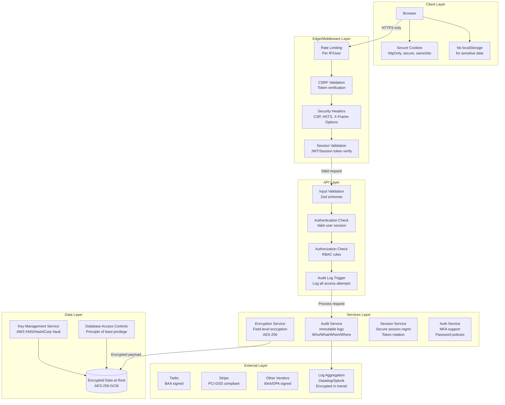
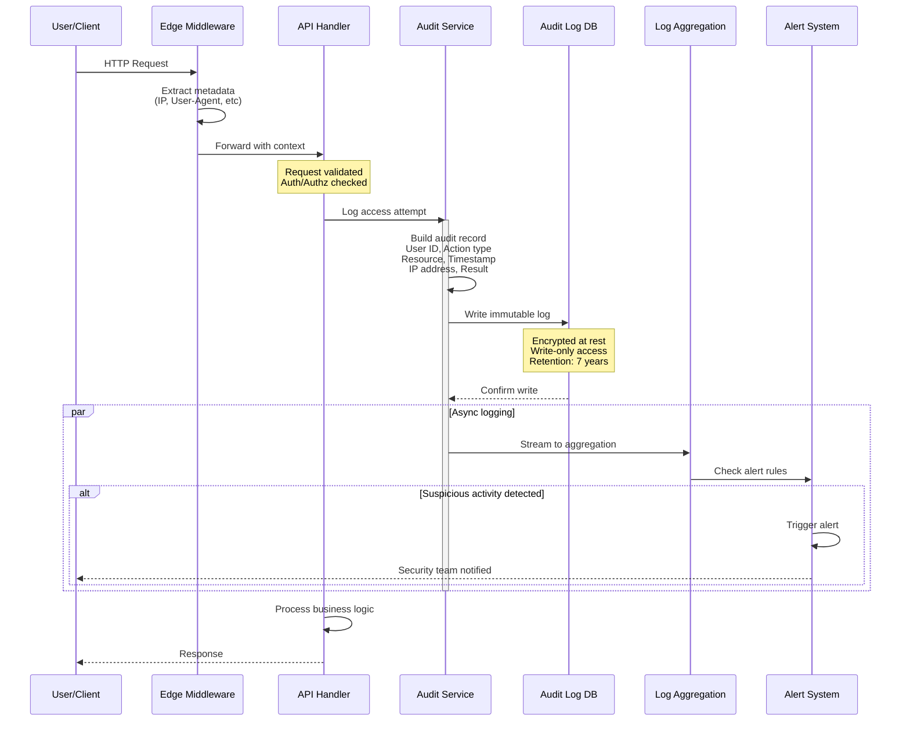
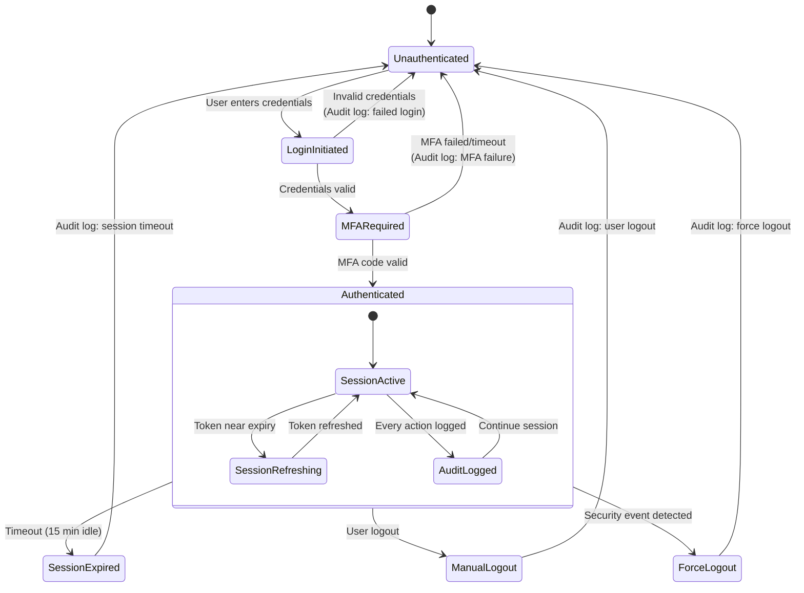
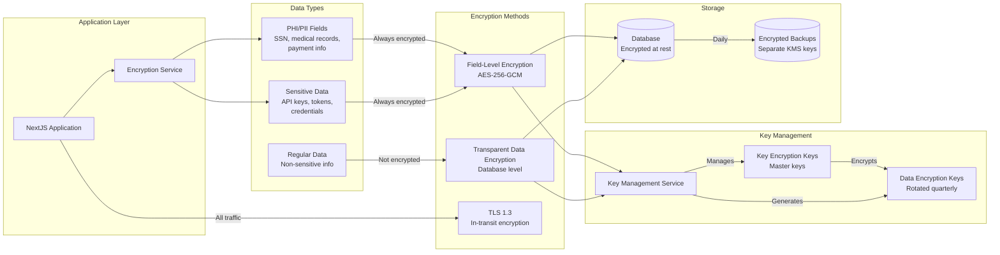

# Security Architecture

[← Back to Index](./index.md)

## Overview

This document defines the security architecture required for HIPAA and SOC-2 Type II compliance. The architecture follows a defense-in-depth approach with multiple security layers, ensuring that even if one layer is compromised, other layers continue to protect sensitive data.

## Architecture Diagram



## Design Principles

### 1. Defense in Depth

Multiple security layers ensure that a breach at one layer doesn't compromise the entire system:

| Layer | Security Controls |
|-------|-------------------|
| Client | Secure cookies, no localStorage for sensitive data |
| Edge | Rate limiting, CSRF protection, security headers |
| API | Input validation, authentication, authorization |
| Service | Encryption, audit logging, session management |
| Data | Encryption at rest, key management, access controls |

### 2. Principle of Least Privilege

Every component has the minimum permissions necessary:

- Users only access data they need for their role
- Services only have permissions for their specific function
- Database connections have restricted access based on operation type
- API routes are protected based on user role

### 3. Zero Trust Architecture

Never trust, always verify:

- Every request is authenticated regardless of source
- Every action is authorized regardless of previous actions
- Every data access is logged regardless of user role
- Network location doesn't grant implicit trust

### 4. Data-Centric Security

Protect the data itself, not just the perimeter:

- Sensitive data encrypted at rest with field-level encryption
- Data classified by sensitivity (PHI, PII, Confidential, Public)
- Encryption keys managed separately from data
- Data access logged for compliance

## Component Architecture

### Audit Logging Flow



### Authentication & Session Flow



### Data Encryption Architecture



## Security Controls by Layer

### Client Layer

| Control | Implementation | Compliance Requirement |
|---------|----------------|----------------------|
| Secure Cookies | `httpOnly`, `secure`, `sameSite=Strict` | SOC-2 CC6.1 |
| No localStorage | Move all sensitive data to secure cookies | HIPAA 164.312(d) |
| HTTPS Only | Redirect all HTTP to HTTPS | HIPAA 164.312(e) |
| Session Timeout | Auto-logout after 15 minutes idle | HIPAA 164.312(a) |

### Edge/Middleware Layer

| Control | Implementation | Compliance Requirement |
|---------|----------------|----------------------|
| Rate Limiting | 100 req/min per IP, 10 auth attempts/15min | SOC-2 CC6.6 |
| CSRF Protection | Token validation on state-changing requests | SOC-2 CC6.1 |
| Security Headers | CSP, HSTS, X-Frame-Options, X-Content-Type | SOC-2 CC6.7 |
| Request Validation | Validate origin, referrer, user-agent | SOC-2 CC6.6 |

### API Layer

| Control | Implementation | Compliance Requirement |
|---------|----------------|----------------------|
| Input Validation | Zod schemas for all inputs | SOC-2 CC7.2 |
| Authentication | JWT/Session token validation | HIPAA 164.312(d) |
| Authorization | Role-based access control (RBAC) | HIPAA 164.312(a) |
| Audit Logging | Log all API access with context | HIPAA 164.312(b) |

### Service Layer

| Control | Implementation | Compliance Requirement |
|---------|----------------|----------------------|
| Audit Service | Immutable logs, 7-year retention | HIPAA 164.312(b) |
| Encryption Service | AES-256-GCM field-level encryption | HIPAA 164.312(e) |
| Session Service | Secure session management with rotation | HIPAA 164.312(d) |
| Auth Service | MFA support, password policies | HIPAA 164.312(d) |

### Data Layer

| Control | Implementation | Compliance Requirement |
|---------|----------------|----------------------|
| Encryption at Rest | AES-256-GCM for all PHI/PII | HIPAA 164.312(a)(2)(iv) |
| Key Management | AWS KMS or HashiCorp Vault | HIPAA 164.312(a)(2)(iv) |
| Access Controls | Database-level RBAC | HIPAA 164.312(a)(1) |
| Backup Encryption | Separate keys for backups | HIPAA 164.312(a)(2)(iv) |

## Current State Analysis

### What Exists

| Component | Current State | Gap |
|-----------|---------------|-----|
| Authentication | SMS-based login | No MFA, weak session management |
| Session Management | httpOnly for auth token | User data in plain cookies |
| Rate Limiting | None | Completely missing |
| Audit Logging | Sentry for errors only | No access audit logs |
| Encryption | HTTPS only | No field-level encryption |
| Input Validation | Minimal | No comprehensive schema validation |

### Critical Gaps

1. **Secrets Management**: `GHL_CLIENT_SECRET` in public env vars
2. **Session Security**: User data exposed in client-readable cookies
3. **Logging**: Sensitive data in console logs
4. **Rate Limiting**: No protection against brute force
5. **Audit Trail**: No compliance-ready audit logging

## File Structure (Target State)

```
app/
├── api/
│   ├── auth/
│   │   ├── login/route.js          # Updated with audit logging
│   │   ├── logout/route.js         # Secure logout with session cleanup
│   │   ├── mfa/
│   │   │   ├── setup/route.js      # MFA enrollment
│   │   │   └── verify/route.js     # MFA verification
│   │   └── session/route.js        # Session validation
│   └── [other routes]/             # Updated with security controls
├── middleware.js                    # Enhanced security middleware
│
components/
├── auth/
│   ├── LoginComponent.js           # Updated for MFA flow
│   └── MFAComponent.js             # New MFA UI component
│
lib/
├── validation/
│   ├── schemas/                    # Zod validation schemas
│   │   ├── auth.js
│   │   ├── user.js
│   │   └── [domain].js
│   └── index.js                    # Schema exports
│
middleware/
├── rateLimit.js                    # Rate limiting middleware
├── csrf.js                         # CSRF protection
└── audit.js                        # Audit logging middleware
│
services/
├── auditService.js                 # Centralized audit logging
├── encryptionService.js            # Field-level encryption
├── sessionService.js               # Secure session management
└── authService.js                  # Authentication with MFA
│
next.config.mjs                     # Security headers configuration
```

## Key Benefits

### Security

- **Multi-layer protection** prevents single point of failure
- **Encryption at rest** protects data even if database is compromised
- **Audit logging** enables forensic analysis and compliance reporting
- **MFA** significantly reduces account compromise risk

### Compliance

- **HIPAA**: Meets all Security Rule technical safeguards
- **SOC 2**: Addresses all Trust Service Criteria for Security
- **Audit Trail**: Provides evidence for compliance audits
- **Documentation**: Supports policy and procedure requirements

### Operational

- **Centralized logging** simplifies monitoring and alerting
- **Consistent patterns** reduce developer errors
- **Automated security** reduces manual security tasks
- **Clear architecture** enables security reviews

## Next Steps

1. Review the [Implementation Plan](./IMPLEMENTATION-PLAN.md) for detailed steps
2. Start with [Phase 1: Critical Security Fixes](./todo/phase-1-critical-security-fixes.md)
3. Follow the implementation guides in `impl/` for each component

## Related Documents

- [Index](./index.md)
- [High-Level Overview](./high-level.md)
- [Implementation Plan](./IMPLEMENTATION-PLAN.md)
- [Compliance Checklist](/hipaa-soc2-compliance-checklist.md)
