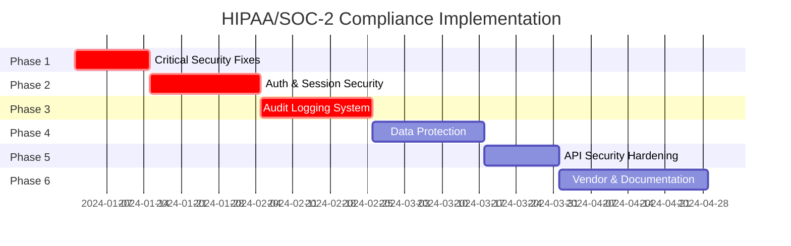

# Implementation Plan

[← Back to Index](./index.md)

## Overview

This document provides the master implementation plan for achieving HIPAA and SOC-2 Type II compliance. Implementation is divided into six phases, each building upon the previous one. Phases must be completed in order as later phases depend on earlier infrastructure.

## Implementation Overview

## Phase Summary

| Phase | Priority | Focus Area | Key Deliverables |
|-------|----------|------------|------------------|
| 1 | CRITICAL | Critical Security Fixes | Secrets moved, cookies secured, logs sanitized |
| 2 | CRITICAL | Authentication & Sessions | Secure sessions, CSRF, MFA foundation |
| 3 | CRITICAL | Audit Logging | Complete audit trail, log retention |
| 4 | HIGH | Data Protection | Field-level encryption, key management |
| 5 | HIGH | API Security | Rate limiting, input validation, CORS |
| 6 | HIGH | Vendor & Documentation | BAAs, policies, incident response |

## Phase 1: Critical Security Fixes

**Document**: [Phase 1 Details](./todo/phase-1-critical-security-fixes.md)

### Objective
Stop active security vulnerabilities that pose immediate risk.

### Scope

| Task | Files Affected | Risk Level |
|------|----------------|------------|
| Move GHL_CLIENT_SECRET to server-only | `app/api/ghl/exchange/route.js` | CRITICAL |
| Remove user data from plain cookies | `middleware.js` | CRITICAL |
| Remove sensitive data from console logs | Multiple API routes | HIGH |
| Add basic rate limiting to auth | `middleware.js`, new middleware | HIGH |
| Add security headers | `next.config.mjs` | HIGH |

### Success Criteria

- [ ] No secrets in `NEXT_PUBLIC_*` environment variables
- [ ] User data only in httpOnly cookies
- [ ] Zero console.log statements containing tokens/credentials
- [ ] Auth endpoints rate limited to 10 requests/15 minutes
- [ ] Security headers present on all responses

### Dependencies
- Access to environment variable configuration
- Ability to deploy middleware changes

---

## Phase 2: Authentication & Session Security

**Document**: [Phase 2 Details](./todo/phase-2-authentication-session.md)

### Objective
Implement secure session management and prepare for MFA.

### Scope

| Task | Files Affected | Risk Level |
|------|----------------|------------|
| Implement secure session service | New: `services/sessionService.js` | CRITICAL |
| Add session timeout (15 min idle) | `middleware.js`, session service | HIGH |
| Implement CSRF protection | New: `middleware/csrf.js` | HIGH |
| Create MFA infrastructure | New: `app/api/auth/mfa/*` | HIGH |
| Update login flow | `components/auth/LoginComponent.js` | MEDIUM |

### Success Criteria

- [ ] All session data in httpOnly cookies only
- [ ] Sessions expire after 15 minutes of inactivity
- [ ] CSRF tokens validated on all state-changing requests
- [ ] MFA enrollment API available
- [ ] MFA verification integrated into login flow

### Dependencies
- Phase 1 completed
- Cookie security implemented

---

## Phase 3: Audit Logging System

**Document**: [Phase 3 Details](./todo/phase-3-audit-logging.md)

### Objective
Implement comprehensive audit logging for compliance.

### Scope

| Task | Files Affected | Risk Level |
|------|----------------|------------|
| Create audit service | New: `services/auditService.js` | CRITICAL |
| Create audit middleware | New: `middleware/audit.js` | CRITICAL |
| Add audit logging to all API routes | All `app/api/*/route.js` | HIGH |
| Configure log retention (7 years) | Backend configuration | HIGH |
| Set up log aggregation | External service config | MEDIUM |

### Audit Event Categories

| Category | Events to Log |
|----------|---------------|
| Authentication | Login, logout, MFA, session timeout, failed attempts |
| Data Access | PHI/PII read, write, delete operations |
| Administration | User management, role changes, settings |
| System | API errors, security events, rate limit hits |

### Success Criteria

- [ ] All authentication events logged with required fields
- [ ] All PHI/PII access logged
- [ ] Audit logs are immutable (write-only)
- [ ] 7-year retention configured
- [ ] Alerting on suspicious activity

### Dependencies
- Phase 2 completed (session service provides user context)

---

## Phase 4: Data Protection & Encryption

**Document**: [Phase 4 Details](./todo/phase-4-data-protection.md)

### Objective
Implement field-level encryption for sensitive data.

### Scope

| Task | Files Affected | Risk Level |
|------|----------------|------------|
| Create encryption service | New: `services/encryptionService.js` | CRITICAL |
| Set up key management | External KMS configuration | CRITICAL |
| Implement data classification | Documentation and code | HIGH |
| Encrypt PHI/PII fields | API routes handling sensitive data | HIGH |
| Implement key rotation | Encryption service | MEDIUM |

### Data Classification

| Classification | Examples | Encryption Required |
|---------------|----------|-------------------|
| PHI | Health records, medical info | Field-level + at rest |
| PII | SSN, DOB, financial info | Field-level + at rest |
| Confidential | API keys, tokens | Field-level + at rest |
| Internal | Business data | At rest only |
| Public | Marketing content | None |

### Success Criteria

- [ ] Encryption service operational
- [ ] KMS configured and accessible
- [ ] All PHI/PII fields encrypted at rest
- [ ] Key rotation process documented
- [ ] Emergency key revocation process documented

### Dependencies
- Phase 3 completed (audit logging for encryption operations)

---

## Phase 5: API Security Hardening

**Document**: [Phase 5 Details](./todo/phase-5-api-security.md)

### Objective
Comprehensive API security with validation and rate limiting.

### Scope

| Task | Files Affected | Risk Level |
|------|----------------|------------|
| Implement comprehensive rate limiting | `middleware/rateLimit.js` | HIGH |
| Add Zod validation to all routes | All API routes | HIGH |
| Configure CORS properly | `next.config.mjs`, middleware | HIGH |
| Add request signing for sensitive ops | Selected API routes | MEDIUM |
| Security testing | All endpoints | MEDIUM |

### Rate Limiting Tiers

| Endpoint Type | Rate Limit | Window |
|--------------|------------|--------|
| Authentication | 10 requests | 15 minutes |
| Password Reset | 3 requests | 1 hour |
| Standard API | 100 requests | 1 minute |
| Bulk Operations | 10 requests | 1 minute |
| Admin Operations | 50 requests | 1 minute |

### Success Criteria

- [ ] All endpoints have appropriate rate limits
- [ ] All inputs validated with Zod schemas
- [ ] CORS configured with explicit allowlist
- [ ] Security scan shows no high/critical vulnerabilities
- [ ] All rate limit responses include Retry-After header

### Dependencies
- Phase 4 completed (encryption service for sensitive data)

---

## Phase 6: Vendor Management & Documentation

**Document**: [Phase 6 Details](./todo/phase-6-vendor-documentation.md)

### Objective
Complete compliance documentation and vendor agreements.

### Scope

| Task | Files Affected | Risk Level |
|------|----------------|------------|
| Obtain BAAs from all vendors | Legal/contracts | CRITICAL |
| Create security policies | New: `docs/security/*` | CRITICAL |
| Create incident response plan | New: `docs/security/incident-response.md` | CRITICAL |
| Document all procedures | New: `docs/security/procedures/*` | HIGH |
| Set up security training | External platform | MEDIUM |

### Required Documents

| Document | HIPAA Requirement | SOC 2 Requirement |
|----------|-------------------|-------------------|
| Information Security Policy | 164.308(a)(1) | CC1.1-CC1.5 |
| Access Control Policy | 164.312(a)(1) | CC6.1-CC6.8 |
| Incident Response Plan | 164.308(a)(6) | CC7.3-CC7.5 |
| Data Classification Policy | 164.312(c)(1) | C1.1-C1.2 |
| Vendor Management Policy | 164.308(b)(1) | CC9.2 |

### Required BAAs

| Vendor | Service | PHI Exposure |
|--------|---------|-------------|
| Twilio | SMS/Voice | Yes - voice calls may contain PHI |
| Stripe | Payments | No - payment data only |
| Sentry | Error Tracking | Possible - errors may contain PHI |
| Vapi | Voice AI | Yes - conversations may contain PHI |
| GHL | CRM | Yes - customer data |
| Hosting Provider | Infrastructure | Yes - hosts application |

### Success Criteria

- [ ] BAAs signed with all vendors handling PHI
- [ ] All required policies documented
- [ ] Incident response plan tested
- [ ] All staff completed security training
- [ ] Compliance documentation ready for audit

### Dependencies
- Phases 1-5 completed (policies describe implemented controls)

---

## Implementation Guides

Detailed implementation guides are available in the `impl/` directory:

| Guide | Purpose | Used In |
|-------|---------|---------|
| [Audit Service](./impl/audit-service.md) | How to implement audit logging | Phase 3 |
| [Rate Limiting](./impl/rate-limiting.md) | How to add rate limiting | Phase 1, 5 |
| [Session Management](./impl/session-management.md) | How to implement secure sessions | Phase 2 |
| [Encryption Service](./impl/encryption-service.md) | How to implement encryption | Phase 4 |
| [Security Headers](./impl/security-headers.md) | How to configure headers | Phase 1 |
| [Input Validation](./impl/input-validation.md) | How to add Zod validation | Phase 5 |

---

## Risk Assessment

### Implementation Risks

| Risk | Probability | Impact | Mitigation |
|------|-------------|--------|------------|
| Session changes break auth | Medium | High | Thorough testing, feature flags |
| Rate limiting blocks legitimate users | Medium | Medium | Start with lenient limits, monitor |
| Encryption causes performance issues | Low | High | Test with production-like data |
| Migration causes downtime | Medium | High | Blue-green deployment |

### Compliance Risks

| Risk | Probability | Impact | Mitigation |
|------|-------------|--------|------------|
| Missing audit logs | High (if delayed) | Critical | Prioritize Phase 3 |
| Vendor refuses BAA | Low | High | Identify alternatives early |
| Incomplete documentation | Medium | Medium | Start documentation in Phase 1 |

---

## Testing Requirements

### Security Testing

| Test Type | When | Tool |
|-----------|------|------|
| Static Analysis (SAST) | Every PR | Snyk, SonarQube |
| Dependency Scanning | Weekly | npm audit, Snyk |
| Dynamic Analysis (DAST) | Post-phase | OWASP ZAP |
| Penetration Testing | Post-Phase 5 | Third-party |

### Compliance Testing

| Test | Frequency | Standard |
|------|-----------|----------|
| Access Control Audit | Quarterly | HIPAA 164.312(a) |
| Audit Log Review | Monthly | HIPAA 164.312(b) |
| Encryption Verification | Quarterly | HIPAA 164.312(e) |
| Incident Response Test | Annually | HIPAA 164.308(a)(6) |

---

## Rollback Procedures

Each phase includes rollback procedures in case of issues:

### Phase 1 Rollback
- Revert environment variable changes
- Restore previous middleware.js
- Revert next.config.mjs changes

### Phase 2 Rollback
- Disable new session service via feature flag
- Fall back to current authentication flow
- Document any sessions that need manual cleanup

### Phase 3 Rollback
- Disable audit middleware via feature flag
- Continue operation without audit logging (accept compliance risk)
- Plan accelerated reimplementation

### Phase 4 Rollback
- Keep data in encrypted state
- Encryption service failure should not block reads
- Implement read-through cache for encrypted data

### Phase 5 Rollback
- Increase rate limits to very high values
- Disable input validation via feature flag (accept security risk)
- Monitor for abuse

### Phase 6 Rollback
- N/A - Documentation cannot be rolled back
- May need to pause compliance certification process

---

## Progress Tracking

Track implementation progress in [Implementation Status](./implementation-status.md).

### Status Definitions

| Status | Definition |
|--------|------------|
| Not Started | Phase has not begun |
| In Progress | Currently being implemented |
| In Review | Implementation complete, pending review |
| Complete | Reviewed and deployed |
| Blocked | Cannot proceed due to dependency |

---

## Related Documents

- [Index](./index.md)
- [Architecture](./ARCHITECTURE.md)
- [High-Level Overview](./high-level.md)
- [Compliance Checklist](/hipaa-soc2-compliance-checklist.md)
