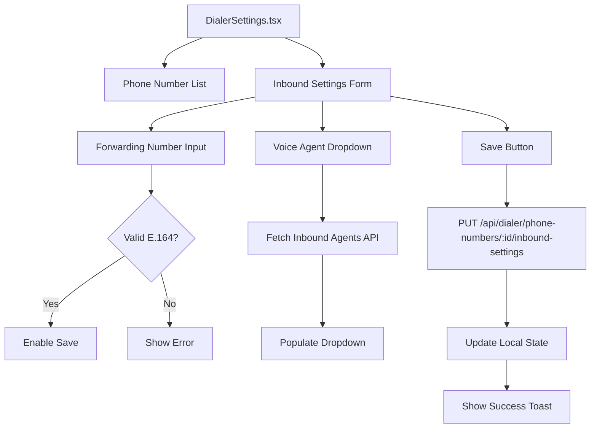
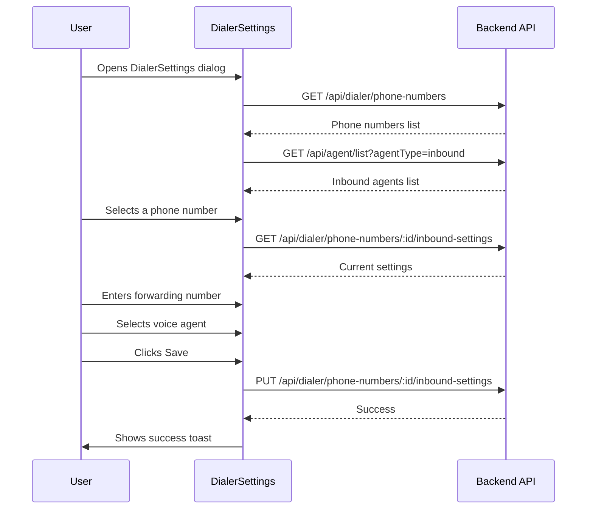

# Inbound Dial Handling - Frontend Architecture

[← Back to Index](./index.md)

## Diagrammatic Overview



## Component Structure

```
components/dialer/
├── DialerSettings.tsx      # Main dialog - ADD inbound settings
├── DialerModal.tsx         # Call UI (no changes)
└── TwilioDialer.tsx        # Simple dialer (no changes)

store/slices/
└── dialerSlice.js          # ADD: inbound settings state (optional)

components/apis/
└── Apis.js                 # ADD: new API endpoint constants
```

## UI Components

### 1. Forwarding Number Input

```tsx
<div className="space-y-2 mb-4">
  <label className="text-sm font-medium">
    Forwarding Number (Optional)
  </label>
  <Input
    type="tel"
    placeholder="+1234567890"
    value={forwardingNumber}
    onChange={(e) => setForwardingNumber(e.target.value)}
  />
  <p className="text-xs text-gray-500">
    Incoming calls will try this number first. If no answer after 25 seconds,
    the call will be routed to your voice agent.
  </p>
</div>
```

### 2. Voice Agent Dropdown

```tsx
<div className="space-y-2">
  <label className="text-sm font-medium">Default Voice Agent *</label>
  <Select
    value={selectedAgentId?.toString()}
    onValueChange={(value) => setSelectedAgentId(Number(value))}
  >
    <SelectTrigger>
      <SelectValue placeholder="Select an inbound agent" />
    </SelectTrigger>
    <SelectContent>
      {inboundAgents.map((agent) => (
        <SelectItem key={agent.id} value={agent.id.toString()}>
          {agent.name}
        </SelectItem>
      ))}
    </SelectContent>
  </Select>
  <p className="text-xs text-gray-500">
    {forwardingNumber
      ? 'This agent will answer if the forwarding number is unavailable.'
      : 'All incoming calls will be answered by this agent.'}
  </p>
</div>
```

## State Management

### Local Component State

```typescript
// In DialerSettings.tsx
const [forwardingNumber, setForwardingNumber] = useState<string>('');
const [selectedAgentId, setSelectedAgentId] = useState<number | null>(null);
const [inboundAgents, setInboundAgents] = useState<Agent[]>([]);
const [loadingAgents, setLoadingAgents] = useState(false);
const [savingSettings, setSavingSettings] = useState(false);
const [selectedPhoneNumberId, setSelectedPhoneNumberId] = useState<number | null>(null);
```

### Data Types

```typescript
interface Agent {
  id: number;
  name: string;
  agentType: 'inbound' | 'outbound';
  modelIdVapi: string;
}

interface InboundSettings {
  forwardingNumber: string | null;
  defaultVoiceAgentId: number | null;
  defaultVoiceAgent?: Agent;
}

interface PhoneNumber {
  id: number;
  phone: string;
  usageType: string;
  // ... existing fields
  forwardingNumber?: string;
  defaultVoiceAgentId?: number;
}
```

## API Integration

### Endpoints

| Endpoint | Method | Purpose |
|----------|--------|---------|
| `/api/agent/list?agentType=inbound` | GET | Fetch user's inbound agents |
| `/api/dialer/phone-numbers/:id/inbound-settings` | GET | Get current settings |
| `/api/dialer/phone-numbers/:id/inbound-settings` | PUT | Save settings |

### API Constants

**File:** `components/apis/Apis.js`

```javascript
// Add to existing Apis object
getInboundSettings: `${BasePath}api/dialer/phone-numbers`,  // + /:id/inbound-settings
updateInboundSettings: `${BasePath}api/dialer/phone-numbers`, // + /:id/inbound-settings
getInboundAgents: `${BasePath}api/agent/list?agentType=inbound`,
```

## User Flow



## Validation Rules

| Field | Rule |
|-------|------|
| Forwarding Number | Optional. If provided, must be E.164 format (`+` followed by digits) |
| Default Voice Agent | Required if user wants inbound routing |

```typescript
const validateForwardingNumber = (value: string): boolean => {
  if (!value) return true; // Optional
  return /^\+[1-9]\d{1,14}$/.test(value);
};

const canSave = (): boolean => {
  const validForwarding = validateForwardingNumber(forwardingNumber);
  const hasAgent = selectedAgentId !== null;
  return validForwarding && hasAgent;
};
```

## Design Decisions

| Decision | Choice | Rationale |
|----------|--------|-----------|
| Settings location | In DialerSettings dialog | Keeps all phone number settings in one place |
| Agent dropdown | Filtered to inbound only | Only inbound agents can handle incoming calls |
| Forwarding validation | E.164 format | Consistent with Twilio requirements |
| Settings scope | Per phone number | Users may have different routing for different numbers |

## Accessibility

- All form fields have visible labels
- Error messages are associated with fields
- Dropdown is keyboard navigable
- Success/error toasts announce to screen readers
