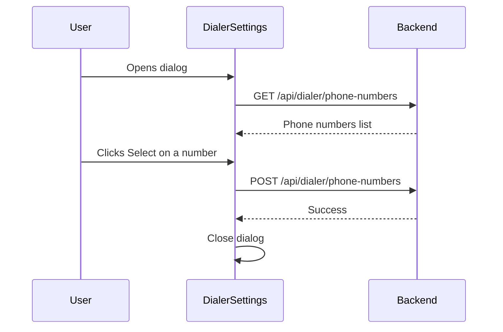

# Inbound Dial Handling - Frontend Current State

[← Back to Index](./index.md)

## Overview

This document describes the current state of the DialerSettings component before adding inbound call routing settings.

## Current Component Structure

**File:** `components/dialer/DialerSettings.tsx`

### Current Purpose

The DialerSettings component currently allows users to:
1. View their available phone numbers
2. Select which phone number to use as the internal dialer number
3. Configure the phone number for the Twilio Voice SDK

### Current UI

```
┌─────────────────────────────────────────────┐
│ Select Internal Dialer Number               │
├─────────────────────────────────────────────┤
│ Choose a Twilio number to use for the       │
│ dialer. This number will be used as the     │
│ caller ID for all dialer calls.             │
├─────────────────────────────────────────────┤
│ +1 (555) 123-4567                           │
│ [SID: PN123...]         [Dialer] [Select]   │
├─────────────────────────────────────────────┤
│ +1 (555) 987-6543                           │
│ [SID: PN456...]         [VAPI]   [Select]   │
└─────────────────────────────────────────────┘
```

### Current State

```typescript
const [phoneNumbers, setPhoneNumbers] = useState<PhoneNumber[]>([]);
const [loading, setLoading] = useState(false);
const [selectedNumberId, setSelectedNumberId] = useState<number | null>(null);
const [open, setOpen] = useState(false);
```

### Current API Calls

```typescript
// Fetch phone numbers
GET /api/dialer/phone-numbers

// Set internal dialer number
POST /api/dialer/phone-numbers
{ phoneNumberId: number }
```

## What's Missing

Currently, the component does NOT have:

1. **Forwarding number configuration** - No way to set where to forward calls
2. **Voice agent selection** - No dropdown to select fallback agent
3. **Inbound settings API integration** - No calls to inbound settings endpoints
4. **Per-number settings display** - Settings are not shown per phone number

## Files Involved

| File | Current Purpose |
|------|-----------------|
| `components/dialer/DialerSettings.tsx` | Phone number selection only |
| `components/apis/Apis.js` | Has `/api/dialer/phone-numbers` only |
| `store/slices/dialerSlice.js` | Has phone numbers state, no inbound settings |

## Current Data Flow



## What Changes

After implementation:

1. **New state variables** for forwarding number and voice agent
2. **New API calls** to fetch/save inbound settings
3. **New UI section** for inbound call routing settings
4. **New useEffects** to load settings when phone selected
5. **Validation** for E.164 phone number format
